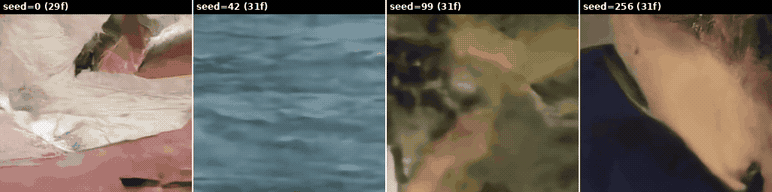

# Dynamic Frame Compression

PyTorch port of a JAX/Flax video generation and compression system combining a **Video VAE** (Variational Autoencoder) with a **Video DiT** (Diffusion Transformer).

- **Video generation** from noise using flow-matching diffusion with learned frame spacing
- **Video compression** via learned frame selection + spatial compression (up to 256x)
- **Video decompression** back to pixel space

All inference runs in **bfloat16**.

---

## Results

### Video Generation (DiT + Frame Gap Prediction)

The DiT generates compressed latent frames **and** predicts the temporal spacing between them. Each latent frame is scattered to its predicted position in the output; gaps are filled by the VAE's learned fill token. Output length is `sum(predicted_gaps)` — determined by the model, not set manually.

Example: 8 latent frames with gaps `[2,6,6,3,5,2,2,4]` → 31 output frames at positions `[2,8,14,17,22,24,26,30]`.



*Four different seeds, each generating 29–31 frames from 8 latent frames.*

### Autoencoder Reconstruction

The VAE reconstructs 256x256 video with **MSE 0.0025** (averaged over 50 real videos).


### Frame-Budget Compression

The encoder assigns each frame an importance score. By keeping only the top-K frames and filling the rest with a learned token, the model compresses video at arbitrary ratios. Shown: Original → All frames → Top-8 → Top-4 → Top-1.


---

## Architecture

### Video VAE
- **Encoder**: 16x16 PatchEmbed → 9 FactoredAttention layers → spatial compression (768→96) + frame selection head
- **Decoder**: Spatial decompression (96→768) → 12 FactoredAttention layers → PatchUnEmbed + 3D UNet refinement
- **FactoredAttention**: Temporal attention+MLP, then spatial attention+MLP, with RoPE and QK-norm
- **Frame selection**: Learned per-frame importance scores; unselected frames replaced by a learned fill token

### Video DiT
- 30 FactoredAttention layers, residual_dim=1024
- Flow matching with Euler integration (continuous timesteps in [0,1])
- **Dual-head output**: velocity field (for denoising) **and** frame gaps (adjacent differences between frame positions)
- Frame gaps determine output length: early gaps are larger (sparse), later gaps are smaller (dense), reflecting learned temporal attention allocation

### 3D UNet (Decoder Refinement)
- 3-level encoder-decoder with skip connections and 3D convolutions

---

## Setup

```bash
python3 -m venv venv && source venv/bin/activate
pip install torch torchvision --index-url https://download.pytorch.org/whl/cu126
pip install einops imageio imageio-ffmpeg pillow

# Optional: JAX for comparison tests
pip install "jax[cuda12]" "flax==0.10.4" optax orbax-checkpoint beartype jaxtyping
```

### Weight Conversion

```bash
python convert_weights.py --model vae \
    --jax_checkpoint /mnt/t9/vae_longterm_saves/gcs2/checkpoint_step_290000 \
    --output vae_pytorch.pt

python convert_weights.py --model dit \
    --jax_checkpoint /mnt/t9/DiT_longterm_saves/midpoint_save/checkpoint_step_250000_master \
    --output dit_pytorch.pt
```

---

## Usage

### Generate Video

Output length is determined by the model's predicted frame gaps.

```bash
python generate.py --num_latent_frames 8 --num_steps 100 --seed 256 --output generated.mp4
```

### Compress / Decompress

```bash
python compress.py --input video.mp4 --output compressed.pt --max_frames 32
python decompress.py --input compressed.pt --output reconstructed.mp4
```

### Evaluate

```bash
python evaluate.py  # generates all docs/ assets
```

---

## Correctness

All outputs match JAX within **1e-3** (TF32 disabled):

```bash
NVIDIA_TF32_OVERRIDE=0 python test_jax_vs_pytorch.py
```

| Test | Max Diff |
|------|----------|
| VAE Encoder | 2.1e-05 |
| VAE Decoder | 4.2e-07 |
| DiT Forward (30 layers) | 1.6e-05 |
| DiT Sampling (100 steps) | 8.9e-04 |
| Full Pipeline | 1.3e-04 |

Key conversion details: LayerNorm eps 1e-6 (not 1e-5), ConvTranspose3d kernel flip, model uses [0,1] pixel range.

---

## File Structure

```
layers.py              # Attention, MLP, FactoredAttention, RoPE, PatchEmbed
unet.py                # 3D UNet
autoencoder.py         # VideoVAE: Encoder, Decoder, compress/decompress
diffusion_model.py     # VideoDiT, Euler sampling, gaps_to_positions
convert_weights.py     # JAX Orbax → PyTorch conversion
generate.py            # Generation with frame gap prediction
compress.py            # Video compression
decompress.py          # Video decompression
evaluate.py            # Evaluation & doc generation
test_jax_vs_pytorch.py # Correctness tests
```

## License

Apache License 2.0
