# Dynamic Frame Compression

PyTorch port of a JAX/Flax video generation and compression system combining a **Video VAE** (Variational Autoencoder) with a **Video DiT** (Diffusion Transformer).

- **Video compression** via learned frame selection + spatial compression (up to 256x)
- **Video generation** from noise using flow-matching diffusion with learned frame spacing

All inference runs in **bfloat16**. Both models were trained for 10 days on 32 Google TPU v6e chips.

**NOTE: Most of the code and documentation was ported from JAX to PyTorch by an LLM. Code correctness has been verified through a large number of tests, and documentation correctness has been manually verified and edited.**

---

## VAE Results

### Reconstruction Quality

The VAE encodes 256x256 video into a compact latent (8x spatial compression: 768→96 channels per patch) and reconstructs it:

| Metric | Value |
|--------|-------|
| **All-frames MSE** | **0.0026** |
| **Bernoulli-sampled MSE** | **0.0025** |
| Mean frame keep rate | 18.5% (5.9 / 32 frames) |
| Average temporal compression | 5.4x |
| Combined compression (spatial × temporal) | **43x** |

The Bernoulli-sampled MSE uses the model's learned frame selection at inference time: each frame is independently kept or dropped based on the encoder's predicted importance score. The model learns to drop frames that are easy to reconstruct from context, so dropping frames barely hurts quality.

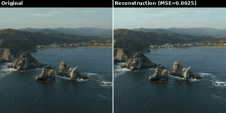

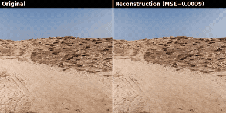

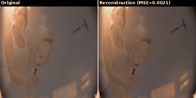

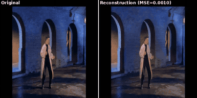

### Frame-Budget Compression

The encoder assigns each frame an importance score. We can keep only the top-K frames and fill the rest with a learned token, compressing at arbitrary temporal ratios on top of the 8x spatial compression.

Shown on 32-frame clips: Original | Top-16 | Top-8 | Top-4 | Top-1

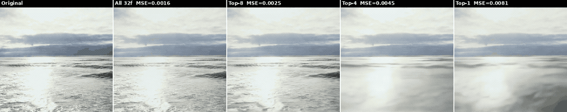

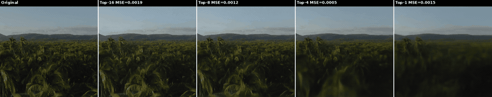

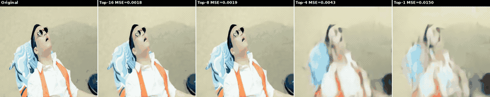

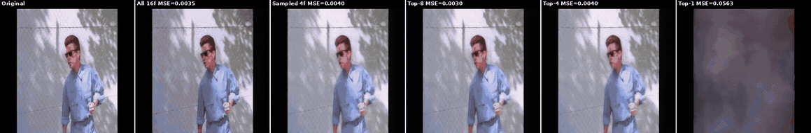

*High-motion videos degrade more at aggressive frame budgets — temporal information is harder to hallucinate from a single keyframe.*

### Bernoulli Compression Rates by Motion

Each frame is independently kept with probability equal to its predicted importance score. Rates below are the mean over 16 Bernoulli draws per clip (`±` is the std across draws). Clip filenames include the frame count, e.g. `bernoulli_slow_seascape_static_32f.gif`.

| Motion | Clip | Frames | Kept frames | Keep rate | Compression | MSE |
|--------|------|-------:|:-----------:|----------:|------------:|-------:|
| slow   | aerial coastline pan     | 32 | 9.2 ± 1.3  | 28.7% | 3.5x  | 0.0097 |
| slow   | tropical island aerial   | 32 | 3.2 ± 1.3  | 10.0% | 10.0x | 0.0011 |
| slow   | seascape (static)        | 32 | 12.4 ± 1.3 | 38.7% | 2.6x  | 0.0024 |
| fast   | beach jumping tricks     | 32 | 7.2 ± 1.0  | 22.7% | 4.4x  | 0.0028 |
| fast   | dance performance        | 32 | 2.6 ± 0.9  |  8.0% | 12.5x | 0.0006 |
| fast   | music video              | 32 | 5.6 ± 0.9  | 17.4% | 5.8x  | 0.0016 |

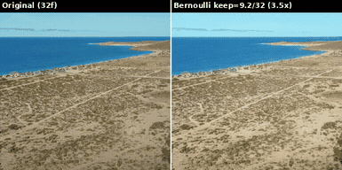


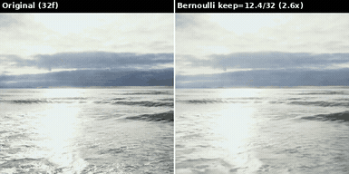

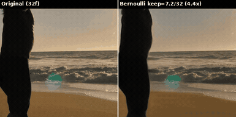

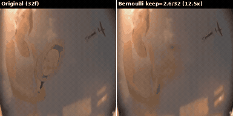

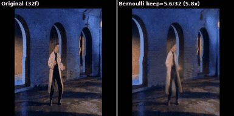

Compression rate is not a monotonic function of motion class — the model keeps frames it needs for faithful reconstruction, not simply frames with high motion. Repetitive high-motion clips (dance, music video) can compress more aggressively than a slowly-panning landscape, because the repeating structure is predictable from a few keyframes. The static seascape is actually the *least* compressed here because its subtle wave texture is hard to reconstruct from a single fill token.

---

## DiT Results

### Video Generation with Frame Gap Prediction

The DiT generates compressed latent frames **and** predicts the temporal spacing between them. Each latent frame is placed at its predicted position; the VAE fills gaps with a learned token. Output length = `sum(predicted_gaps)`. This DiT was heavily undertrained (~8000 TPU v6e hours and 100 million frames), so it serves as a proof of concept that the VAE latent space can efficiently train diffusion/flow matching models. 

Example: 8 latent frames with gaps `[2,6,6,3,5,2,2,4]` → 31 output frames.

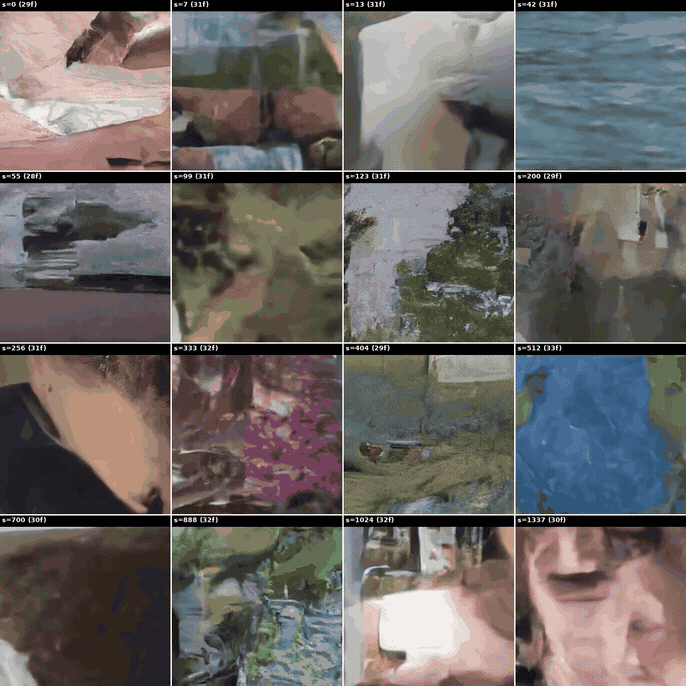

*25 seeds, 8 latent frames each. Labels show seed and output frame count (28–33 frames).*

---

## Setup

```bash
python3 -m venv venv && source venv/bin/activate
pip install torch torchvision --index-url https://download.pytorch.org/whl/cu126
pip install einops imageio imageio-ffmpeg pillow huggingface_hub

# Optional: JAX comparison tests
pip install "jax[cuda12]" "flax==0.10.4" optax orbax-checkpoint beartype jaxtyping
```

### Weights

Pre-trained weights are hosted on HuggingFace and **downloaded automatically** the first time you run `generate.py`, `compress.py`, or `decompress.py`:

- [`floatingtrees2/dynamic-frame-compression`](https://huggingface.co/floatingtrees2/dynamic-frame-compression) — `vae_pytorch.pt` (652 MB), `dit_pytorch.pt` (1.9 GB)

---

## Usage

### Generate Video

```bash
python generate.py --num_latent_frames 8 --num_steps 100 --seed 256 --output generated.mp4
```

### Compress / Decompress

```bash
python compress.py --input video.mp4 --output compressed.pt --max_frames 32
python decompress.py --input compressed.pt --output reconstructed.mp4
```

### Evaluate

```bash
python evaluate.py  # regenerates all docs/ assets
```

## File Structure

```
layers.py              # Attention, MLP, FactoredAttention, RoPE, PatchEmbed
unet.py                # 3D UNet
autoencoder.py         # VideoVAE: Encoder, Decoder, compress/decompress
diffusion_model.py     # VideoDiT, Euler sampling, gaps_to_positions
model_loader.py        # Auto-download weights from HuggingFace
convert_weights.py     # JAX Orbax → PyTorch conversion
generate.py            # Generation with frame gap prediction
compress.py            # Video compression
decompress.py          # Video decompression
evaluate.py            # Evaluation & doc generation
test_jax_vs_pytorch.py # Correctness tests
```

---

## Architecture

### Video VAE
- **Encoder**: 16x16 PatchEmbed → 9 FactoredAttention layers → spatial compression (768→96) + frame selection head
- **Decoder**: Spatial decompression (96→768) → 12 FactoredAttention layers → PatchUnEmbed + 3D UNet refinement
- **FactoredAttention**: Temporal attention+MLP, then spatial attention+MLP, with RoPE and QK-norm
- **Frame selection**: Learned per-frame importance; unselected frames replaced by a learned fill token

### Video DiT
- 30 FactoredAttention layers, residual_dim=1024
- Flow matching with Euler integration (continuous timesteps [0,1])
- **Dual-head output**: velocity field (denoising) + frame gaps (temporal spacing)
- Gaps determine output length — no trailing blank frames

### 3D UNet (Decoder Refinement)
- 3-level encoder-decoder with skip connections and 3D convolutions

---

## License

Apache License 2.0
