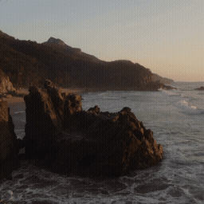
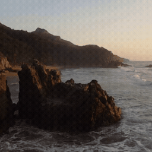
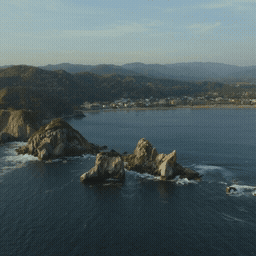
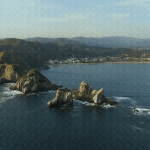
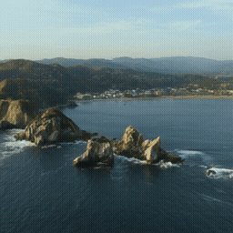
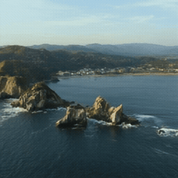
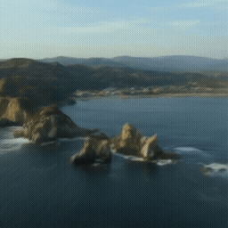
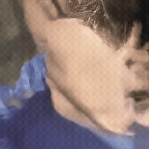

# Dynamic Frame Compression

PyTorch port of a JAX/Flax video generation and compression system combining a **Video VAE** (Variational Autoencoder) with a **Video DiT** (Diffusion Transformer). The system supports:

- **Video generation** from noise using flow-matching diffusion
- **Video compression** via learned frame selection + spatial compression
- **Video decompression** back to pixel space

All inference runs in **bfloat16** for efficient GPU usage.

---

## Results

### Autoencoder Reconstruction Quality

The VAE encodes 256x256 video frames into a compact latent space (8x spatial compression: 768 -> 96 channels) and reconstructs them. Evaluated on 50 real videos:

| Metric | Value |
|--------|-------|
| **Mean MSE** | **0.0025** |
| Mean MAE | 0.0389 |

Original (top), VAE reconstruction (middle), and 5x-amplified difference (bottom):


Side-by-side video (original left, reconstruction right):

| Original | VAE Reconstruction |
|:---:|:---:|
|  |  |

### Frame-Budget Compression

The encoder learns which frames are most important. We can compress by keeping only the top-K frames (by learned selection score) and replacing the rest with a learned fill token. The decoder then reconstructs the full video.

Compression of a 32-frame aerial coastal video:

| Frames Kept | MSE | Spatial+Temporal Compression |
|-------------|---------|-------------|
| 32 (all) | 0.0025 | 8x (spatial only) |
| 16 | 0.0038 | 16x |
| 8 | 0.0037 | 32x |
| 4 | 0.0048 | 64x |
| 2 | 0.0063 | 128x |
| 1 | 0.0031 | 256x |
| Standard (p>0.5, 3f) | 0.0053 | ~85x |


*Each row shows 8 evenly-spaced frames from the 32-frame video. Top is original; subsequent rows show reconstruction with progressively fewer frames kept.*

| Original | All 32 frames | Top-8 | Top-4 |
|:---:|:---:|:---:|:---:|
|  |  |  |  |

| Top-2 | Top-1 | Standard (3f) |
|:---:|:---:|:---:|
|  |  |  |

### Generated Video (DiT + Frame Gap Prediction)

The DiT generates compressed latent frames **and** predicts the temporal spacing between them. The predicted gaps determine where each latent frame maps in the output video; the VAE decoder fills the gaps with a learned fill token. This means the output video length is determined by the model (`total_frames = sum(gaps)`), not set manually — so there are no trailing blank frames.

Example with 16 latent frames, seed 256:
```
Predicted gaps:   [1, 5, 4, 3, 4, 3, 2, 2, 1, 1, 1, 1, 1, 1, 1, 1]
Frame positions:  [1, 6, 10, 13, 17, 20, 22, 24, 25, 26, 27, 28, 29, 30, 31, 32]
Output length:    33 frames (from 16 latent frames)
```

The model learned to space early frames further apart (gaps of 3–5) and pack later frames tightly (gaps of 1), allocating more detail to the end of the sequence.

Evenly-sampled frames from the 33-frame output:




---

## Architecture

### Video VAE (Autoencoder)
- **Encoder**: PatchEmbedding (16x16 patches) -> 9 FactoredAttention layers -> spatial compression (768->96) + variance estimation + frame selection
- **Decoder**: Spatial decompression (96->768) -> 12 FactoredAttention layers -> PatchUnEmbedding + 3D UNet refinement
- **FactoredAttention**: Temporal attention+MLP then spatial attention+MLP, with RoPE and QK-norm
- **Frame selection**: Learned per-frame importance scores for dynamic temporal compression
- Resolution: 256x256, patch size 16x16 (256 spatial tokens), up to 64 temporal frames

### Video DiT (Diffusion Transformer)
- 30 FactoredAttention layers with residual_dim=1024
- Flow matching with Euler integration (continuous timesteps in [0,1])
- Timestep conditioning via zero-initialized linear projection
- **Dual-head output**: predicts the denoised latent (velocity field) **and** frame gaps (adjacent differences between selected frame positions)
- Frame gaps determine output video length: `total_frames = sum(gaps)`. Early gaps tend to be larger (sparse coverage of slow motion), later gaps tend to be 1 (dense detail)
- Operates on compressed VAE latents (96-dim)

### 3D UNet (Decoder Refinement)
- 3-level encoder-decoder with skip connections
- 3D convolutions (temporal_kernel=3) for spatiotemporal coherence
- GroupNorm + SiLU, zero-initialized final conv

---

## File Structure

```
dynamic-frame-compression/
├── layers.py                 # Attention, MLP, FactoredAttention, RoPE, PatchEmbed
├── unet.py                   # 3D UNet: ConvBlock3D, DownBlock3D, UpBlock3D
├── autoencoder.py            # VideoVAE: Encoder, Decoder, compress/decompress
├── diffusion_model.py        # VideoDiT + Euler sampling
├── convert_weights.py        # JAX Orbax -> PyTorch weight conversion
├── generate.py               # Video generation (DiT + VAE decode)
├── compress.py               # Video compression (VAE encode)
├── decompress.py             # Video decompression (VAE decode)
├── evaluate.py               # Evaluation & documentation image/video generation
├── test_jax_vs_pytorch.py    # JAX vs PyTorch correctness tests
└── docs/                     # Generated documentation images and videos
```

---

## Setup

### Prerequisites
- NVIDIA GPU with CUDA support (tested on RTX 4090)
- Python 3.10+

### Environment

```bash
python3 -m venv venv && source venv/bin/activate

# PyTorch (adjust cu126 to match your CUDA version)
pip install torch torchvision --index-url https://download.pytorch.org/whl/cu126

# Dependencies
pip install einops imageio imageio-ffmpeg pillow

# For JAX comparison tests (optional):
pip install "jax[cuda12]" "flax==0.10.4" optax orbax-checkpoint beartype jaxtyping
```

### Weight Conversion

Convert JAX/Orbax checkpoints to PyTorch:

```bash
# VAE (encoder + decoder + UNet)
python convert_weights.py \
    --model vae \
    --jax_checkpoint /mnt/t9/vae_longterm_saves/gcs2/checkpoint_step_290000 \
    --output vae_pytorch.pt

# DiT (diffusion transformer)
python convert_weights.py \
    --model dit \
    --jax_checkpoint /mnt/t9/DiT_longterm_saves/midpoint_save/checkpoint_step_250000_master \
    --output dit_pytorch.pt
```

The conversion handles:
- Linear weight transposition (`kernel` (in,out) -> `weight` (out,in))
- Conv3d kernel reordering (JAX `THWIO` -> PyTorch `OITHW`)
- **ConvTranspose3d kernel flip** (Flax internally flips spatial dims; PyTorch does not)
- LayerNorm/GroupNorm `scale` -> `weight`, epsilon 1e-6
- ROPE cos/sin buffers are recomputed deterministically

---

## Usage

### Generate Video

The DiT predicts both latent frames and their temporal spacing. Output length is determined automatically from the predicted frame gaps.

```bash
# Generate from 16 latent frames (output length determined by model)
python generate.py --num_latent_frames 16 --num_steps 100 --seed 256 --output generated.mp4

# Save individual frames as PNGs
python generate.py --num_latent_frames 16 --num_steps 100 --output video.mp4 --save_frames frames/
```

### Compress a Video

```bash
python compress.py --input video.mp4 --output compressed.pt --max_frames 32
```

Output `.pt` contains: `compressed` (latent), `selection_indices`, `compression_mask`, metadata.

### Decompress

```bash
python decompress.py --input compressed.pt --output reconstructed.mp4
```

### Evaluate & Generate Documentation

```bash
python evaluate.py
# Outputs to docs/: images, comparison GIFs, eval_results.txt
```

---

## Correctness Verification

All model outputs match JAX within **1e-3** (tested with TF32 disabled):

```bash
NVIDIA_TF32_OVERRIDE=0 python test_jax_vs_pytorch.py
```

```
VAE Encoder mean:       max_diff = 2.12e-05  PASS
VAE Encoder variance:   max_diff = 9.91e-07  PASS
VAE Encoder selection:  max_diff = 5.66e-06  PASS
VAE Decoder output:     max_diff = 4.17e-07  PASS
DiT forward latent:     max_diff = 1.62e-05  PASS
DiT forward spacing:    max_diff = 9.54e-06  PASS
DiT sampling (100 steps): max_diff = 8.85e-04  PASS
Full pipeline video:    max_diff = 1.32e-04  PASS
```

Key conversion details required for correctness:
- **LayerNorm/GroupNorm epsilon**: Flax defaults to `1e-6`, PyTorch defaults to `1e-5`
- **ConvTranspose3d kernel flip**: Flax's `lax.conv_transpose` flips the kernel internally
- **Model pixel range**: The model operates in **[0, 1]** pixel space (not [-1, 1])

---

## Model Hyperparameters

| | VAE | DiT |
|---|---|---|
| **Depth** | 9 enc / 12 dec | 30 |
| **Hidden dim** | 768 | 1024 |
| **MLP dim** | 1536 | 2048 |
| **Heads** | 8 | 8 |
| **QKV features** | 512 | 1024 |
| **Spatial patches** | 256 | 256 |
| **Max temporal** | 64 | 64 |
| **Compressed dim** | 96 | 96 (input) |

## Source Checkpoints

| Model | Path | Format |
|-------|------|--------|
| VAE | `/mnt/t9/vae_longterm_saves/gcs2/checkpoint_step_290000` | Orbax |
| DiT | `/mnt/t9/DiT_longterm_saves/midpoint_save/checkpoint_step_250000_master` | Orbax |
| JAX source | `/projects/video-VAE/diffusion/` | Python |

## License

Apache License 2.0
